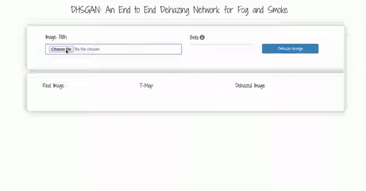

# DHSGAN

## Introduction

This is the official implementation of "DHSGAN: An End to End Dehazing Network for Fog and Smoke", published in 
14th Asian Conference on Computer Vision (ACCV) 2018 in Perth, WA, Australia. [[paper]](https://drive.google.com/file/d/1uoy5JAfXSfCjd0VtJoQEu_6dT8Z9V-DO/view?usp=sharing)
[[pretrained model]](https://drive.google.com/file/d/1U0Dn2IUZfC_odITYCSkSYDj7sIg6PjLZ/view?usp=sharing)
[[springer link]](https://link.springer.com/chapter/10.1007/978-3-030-20873-8_38)




## Dependencies

- Python 2.7 (Also compatible with python 3.5, 3.8 {checked with pycharm code inspection})
- Tensorflow == 1.4.0 (Should work on other versions with minor changes)
- Opencv-python (Used for video loading and saving
- Flask (For webapp)

The code is tested on :- Ubuntu 14.04 LTS with CPU architecture x86_64 + Nvidia Titan X 1070 + cuda9.0.

## Getting Started

### Training
For the model used in paper, we use image-depth pairs from publicly available datasets 
[NYU-v2](https://cs.nyu.edu/~silberman/datasets/nyu_depth_v2.html) (indoor),
[SceneNet](https://robotvault.bitbucket.io/scenenet-rgbd.html) (indoor), 
[RESIDE](https://sites.google.com/view/reside-dehaze-datasets/reside-v0) (indoor-outdoor) and 
[KITTI](http://www.cvlibs.net/datasets/kitti/eval_depth_all.php) (outdoor)
to synthesize training samples Hazy/Clean/Transmission Images. For getting started, 
[RESIDE](https://sites.google.com/view/reside-dehaze-datasets/reside-v0) (indoor-outdoor) can be good dataset to train 
generalized model.

After downloading and extracting RESIDE, first train only (optional) DHSGAN generator network by executing (after editing as per your config)
 train_DHSGAN_generator.sh:
 ```bash
 #!/usr/bin/env bash
CUDA_VISIBLE_DEVICES=0 python main.py \
    --output_dir ./experiment_generator/ \
    --summary_dir ./experiment_generator/log/ \
    --mode train \
    --is_training True \
    --task SRResnet \
    --batch_size 4 \
    --flip True \
    --random_crop True \
    --crop_size 96 \
    --input_dir_LR ./train/train_global_reside/image_hazed/ \
    --input_dir_HR ./train/train_global_reside/image_real/ \
    --vgg_ckpt ./train/vgg_19.ckpt\
    --num_resblock 8 \
    --name_queue_capacity 4096 \
    --image_queue_capacity 4096 \
    --perceptual_mode MSE \
    --queue_thread 12 \
    --ratio 0.001 \
    --learning_rate 0.0001 \
    --decay_step 100000 \
    --decay_rate 0.1 \
    --stair True \
    --beta 0.9 \
    --max_iter 200000 \
    --save_freq 20000
```

Then DHSGAN generator is finetuned by GAN framework. To train full DHSGAN execute train_DHSGAN.sh:
 ```bash
#!/usr/bin/env bash
CUDA_VISIBLE_DEVICES=0 python main.py \
    --output_dir ./experiment_DHSGAN/ \
    --summary_dir ./experiment_DHSGAN/log/ \
    --mode train \
    --is_training True \
    --task SRGAN \
    --batch_size 4 \
    --flip True \
    --random_crop True \
    --crop_size 96 \
    --tmap_beta 2.0 \
    --input_dir_LR ./train/train_global_reside/image_hazed/ \
    --input_dir_HR ./train/train_global_reside/image_real/ \
    --vgg_ckpt ./train/vgg_19.ckpt\
    --num_resblock 8 \
    --perceptual_mode VGG54 \
    --ratio 0.001 \
    --learning_rate 0.00001 \
    --decay_step 100000 \
    --decay_rate 0.1 \
    --stair True \
    --beta 0.9 \
    --max_iter 200000 \
    --queue_thread 12 \
    --vgg_scaling 0.0061 \
    --pre_trained_model_type SRGAN \
    --pre_trained_model True \
    --checkpoint ./experiment_generator/model-170000
```

**NOTE**: To make the code more usable, the transmission module in this repository is replaced with [CAP](https://ieeexplore.ieee.org/document/7128396).
The transmission module used in paper was originally implemented in Torch. 

### Inference

The pre-trained model can be downloaded from [Here](https://drive.google.com/file/d/1U0Dn2IUZfC_odITYCSkSYDj7sIg6PjLZ/view?usp=sharing).
To run the inference over multiple images, use inference_DHSGAN.sh:
 ```bash
 #!/usr/bin/env bash
CUDA_VISIBLE_DEVICES=0 python main.py \
    --output_dir ./fog_exp4/ \
    --summary_dir ./log/ \
    --mode inference \
    --is_training False \
    --task SRGAN \
    --input_dir_LR ./test/image_hazed \
    --tmap_beta 2.0  \
    --num_resblock 16 \
    --perceptual_mode VGG54 \
    --pre_trained_model True \
    --checkpoint ./checkpoint/model-170000
```

Additionally we also implement a webapp for demo, which doesnt require any deep learning knowledge. To run the demo use:
 ```bash
python webapp.py --model_path {downloaded_model_folder}/model-170000
```
After running above, the demo can be accessed at: http://127.0.0.1:5000/
## Citation

If you use our work. Please cite:
```bash
@InProceedings{10.1007/978-3-030-20873-8_38,
author="Malav, Ramavtar
and Kim, Ayoung
and Sahoo, Soumya Ranjan
and Pandey, Gaurav",
editor="Jawahar, C.V.
and Li, Hongdong
and Mori, Greg
and Schindler, Konrad",
title="DHSGAN: An End to End Dehazing Network for Fog and Smoke",
booktitle="Computer Vision -- ACCV 2018",
year="2019",
publisher="Springer International Publishing",
address="Cham",
pages="593--608",
abstract="In this paper we propose a novel end-to-end convolution dehazing architecture, called De-Haze and Smoke GAN (DHSGAN). The model is trained under a generative adversarial network framework to effectively learn the underlying distribution of clean images for the generation of realistic haze-free images. We train the model on a dataset that is synthesized to include image degradation scenarios from varied conditions of fog, haze, and smoke in both indoor and outdoor settings. Experimental results on both synthetic and natural degraded images demonstrate that our method shows significant robustness over different haze conditions in comparison to the state-of-the-art methods. A group of studies are conducted to evaluate the effectiveness of each module of the proposed method.",
isbn="978-3-030-20873-8"
}
```

## Thanks

This Repo heavily used code from these three awesome Repositories:
- [https://github.com/brade31919/SRGAN-tensorflow](https://github.com/brade31919/SRGAN-tensorflow)
- [https://github.com/jevonswang/Color-Attenuation-Prior-Dehazing](https://github.com/jevonswang/Color-Attenuation-Prior-Dehazing)
- [https://github.com/vinhkhuc/MemN2N-babi-python](https://github.com/vinhkhuc/MemN2N-babi-python) (Webapp Inspiration)
